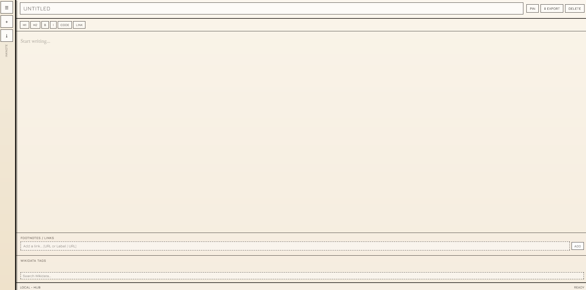

# InkNote



A local-first note editor built as a **single-file prototype HTML app**.

## Status

**Prototype / proof of concept**
This project is currently packaged as one standalone `.html` file with embedded CSS and JavaScript.

## Overview

InkNote is a browser-based writing space that combines:

* a minimal note editor
* a slide-out notes drawer
* markdown-style formatting buttons
* footnote / link management
* Wikidata tag lookup and storage
* local persistence through `localStorage`
* JSON export for notes backup

The interface is designed around a paper-like, brutalist visual style with a focus on research notes and source-backed writing.

## Features

* Create, edit, pin, delete, and search notes
* Auto-save note title and body content locally
* Export notes as JSON
* Add footnotes or external links
* Search and attach Wikidata entities as tags
* Markdown helper buttons for:

  * H1
  * H2
  * bold
  * italic
  * code
  * link syntax
* Responsive layout with a collapsible notes drawer

## Tech Stack

* **HTML**
* **CSS**
* **Vanilla JavaScript**
* **localStorage** for persistence
* **Wikidata API** for tag search

## File Structure

At the moment, the app lives in one file:

```bash
InkNoteV1.2.html
```

## How It Works

1. Open the HTML file in a browser.
2. Create or select a note from the drawer.
3. Write in the editor.
4. Add footnotes / links below the editor.
5. Search Wikidata entities and attach them as tags.
6. Export your notes as JSON when needed.

## Data Model

Each note is stored as an object with fields like:

* `id`
* `title`
* `content`
* `pinned`
* `updated`
* `tags`
* `footnotes`

## Local Storage

Notes are saved in the browser using `localStorage`, so data stays on the device unless exported.

## Keyboard Shortcuts

* `Cmd/Ctrl + N` — new note
* `Cmd/Ctrl + P` — pin/unpin note
* `Cmd/Ctrl + K` — focus search

## Notes

This is a prototype meant to explore the workflow and visual language before splitting into a more maintainable project structure.

## Possible Next Steps

* split HTML / CSS / JS into separate files
* add markdown preview
* add drag-and-drop reordering
* improve mobile drawer behavior
* persist richer metadata
* add sync or import support

## License

Add your preferred license here.
